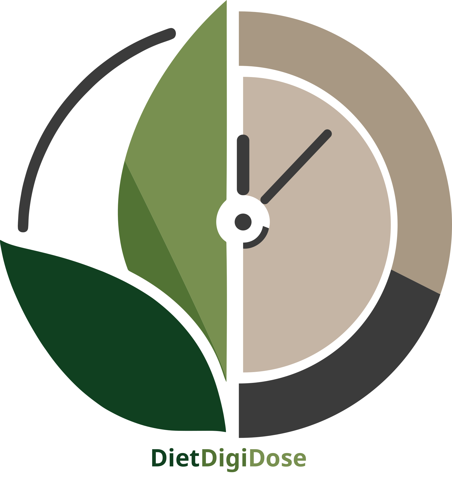

# DietDigiDose (食光烙记)

<p align="center">
  
</p>

<p align="center">
  <strong>Turn what is already in your kitchen into the next meal you can actually cook.</strong>
</p>

<p align="center">
  <a href="README.md">简体中文</a> · English
</p>

DietDigiDose is an open-source food management application for individuals and small households. Starting with pantry inventory and expiry awareness, it connects recipe matching, shopping, cooking, stock deduction, and diet logging into one verifiable everyday workflow. Health profiles, community content, and safety-bounded AI assistance complement that core experience.

> [!IMPORTANT]
> The mobile client remains in its trusted Beta hardening phase and has not been publicly released. Nutrition estimates and AI output are for everyday reference only and are not medical diagnosis or treatment advice. Beta builds should not be used with real sensitive health data.

## Core experience

```text
Record household ingredients
  → identify available or expiring food
  → match recipes that can actually be cooked
  → finish cooking and deduct inventory
  → create a diet record automatically
```

The repository currently includes:

- Household inventory, expiry dates, kitchenware, and shopping lists
- Recipe matching based on inventory, expiring food, allergens, and available equipment
- A cooking queue and step mode with idempotent stock deduction and diet logging
- Nutrition intake, health profiles, reminders, and trend insights
- Recipe search, favorites, submissions, follows, and community content
- AI nutrition Q&A, ingredient and meal recognition, receipt scanning, and voice interaction
- An admin console for users, recipes, community content, Agent runs, AI configuration, and security audits

## Version and status

- **Product version:** `1.0.6`
- **Release cycle:** `26w36`
- **Candidate snapshot:** `26w36a`
- **Stage:** trusted Beta hardening
- **Last updated:** September 3, 2026

Static checks, automated tests, builds, release metadata validation, and production dependency auditing for all three applications are enforced in CI. The website, admin console, API, and HTTPS production environment are live. Before external mobile testing, the project still needs iOS and Android candidates built from the same commit, end-to-end testing on both platforms, and an isolated backup-restore exercise.

See the [candidate records](docs/release-candidate-26w37a.md) and [device Beta checklist](docs/device-beta-checklist.md) for the exact boundary. Candidate records retain their original version metadata and are not rewritten for later releases.

## Live services

| Entry | URL |
| --- | --- |
| Product website | [dietdigidose.top](https://dietdigidose.top/) |
| Admin console | [dietdigidose.top/login](https://dietdigidose.top/login) |
| API health check | [dietdigidose.top/api/v1/health](https://dietdigidose.top/api/v1/health) |

The ICP filing text and destination shown in the website footer are configured through **Site settings** in the admin console instead of being hard-coded in the frontend.

## Architecture

This repository is a pnpm workspace monorepo:

| Package | Main technologies | Purpose |
| --- | --- | --- |
| `client` | Expo 54, React Native, Expo Router, Uniwind | iOS, Android, and web client |
| `server` | Express, TypeScript, SQLite/PostgreSQL, Drizzle, LangGraph | API, business transactions, data, and AI Agent runtime |
| `admin` | React, Vite, Tailwind CSS | Moderation and system administration console |
| `deploy` | Docker Compose, Caddy | HTTPS deployment, persistence, and recovery exercises |

Local development uses SQLite by default, while the current production environment uses PostgreSQL. Supabase remains optional object storage for community media.

## Repository layout

```text
Dietdigidose/
├── client/          # Expo routes, screens, components, and assets
├── server/          # Express API, database migrations, and import scripts
├── admin/           # React administration console
├── deploy/          # Staging deployment, proxy, and smoke-test configuration
├── docs/            # Product roadmap, acceptance checklists, and operations docs
├── eslint-plugins/  # Project-specific ESLint rules
└── scripts/         # Workspace and release validation scripts
```

## Quick start

### Requirements

- Node.js 20 or newer (CI uses Node.js 22)
- pnpm 10.18.0

### Install and configure

```bash
pnpm install --frozen-lockfile
cp client/.env.example client/.env
cp server/.env.example server/.env
```

At minimum, point the client to the local API:

```dotenv
EXPO_PUBLIC_BACKEND_BASE_URL=http://localhost:9090
```

Development mode can generate a local JWT secret automatically. Production and staging must define a strong `JWT_SECRET`, `ADMIN_INITIAL_PASSWORD`, explicit `CORS_ORIGINS`, and a `DATABASE_PATH` on persistent storage. See [`server/.env.example`](server/.env.example) for all settings.

### Run

Start Expo Web and the Express API:

```bash
pnpm dev
```

Start the admin console in another terminal:

```bash
pnpm dev:admin
```

Use `pnpm dev:all` if you need all three log streams in one terminal.

| Service | Default URL |
| --- | --- |
| Expo Web | `http://localhost:8080` |
| API | `http://localhost:9090` |
| Health check | `http://localhost:9090/api/v1/health` |
| Admin console | `http://localhost:5173` |

The local SQLite database is created automatically at `server/data/dietdigidose.db`; that directory is ignored by Git.

## Common commands

| Command | Purpose |
| --- | --- |
| `pnpm dev` | Start the client and API |
| `pnpm dev:admin` | Start the admin console |
| `pnpm dev:all` | Start the client, API, and admin console |
| `pnpm lint:all` | Check `client`, `server`, and `admin` |
| `pnpm test:all` | Run all automated tests |
| `pnpm build:client` | Export the Expo web build |
| `pnpm build:server` | Build the Express server |
| `pnpm build:admin` | Build the admin console |
| `pnpm validate:release` | Validate versions, snapshot, and native build numbers |
| `pnpm audit:prod` | Audit production dependencies |

## Release and security boundary

`client/eas.json` contains iOS and Android preview and production profiles, both of which require an HTTPS API. The `preview-http` and simulator profiles exist only for controlled development testing. They must not be distributed as external Beta candidates or used with real sensitive data.

The production dependency audit currently has narrow temporary exceptions for `CVE-2025-71329` and `CVE-2025-71330` in the Expo/Metro build chain. No upstream fix is available yet, so the current state must not be described as “zero vulnerabilities.” These exceptions must be reviewed after every Expo/Metro upgrade and before every candidate release.

Read these documents before deployment:

- [Development and Beta hardening checklist](TODO.md)
- [Product roadmap](docs/product-roadmap.md)
- [Operations and recovery guide](docs/operations.md)
- [Security policy](SECURITY.md)

## Data and third-party content

The project can import data from HowToCook, Open Food Facts, Wikibooks, USDA, and the Taiwan FDA. Imported records must retain source URLs, versions, and license metadata. Never commit local databases, backups containing user data, or real secrets.

See [THIRD_PARTY_NOTICES.md](THIRD_PARTY_NOTICES.md) for bundled source code, fonts, and recipe data. License copies are stored in [`LICENSES/`](LICENSES/).

## Project history

The DietDigiDose concept originated during a 2025 university software innovation competition. It received first prize in the Southwest regional round and third prize nationally in the [Software Design Innovation category of the 18th National College Student Software Innovation Competition](https://www.swcontest.com.cn/information?activeTab=notice&detailId=d6d9f4a293ba48f59cec8824ca901332).

The project restarted in 2026 with a new codebase. The [earlier competition repository](https://github.com/heathcetide/shiguang-brand) is preserved as historical material. The current implementation retains the name, problem context, and product vision, while its architecture, data model, and engineering implementation were redesigned for the current requirements.

## Contributing

Read [CONTRIBUTING.md](CONTRIBUTING.md) before submitting changes. Report security issues privately according to [SECURITY.md](SECURITY.md); do not publicly disclose an exploitable vulnerability.

## License

Project-owned source code is available under the [MIT License](LICENSE). Third-party components and content remain subject to their respective licenses.
