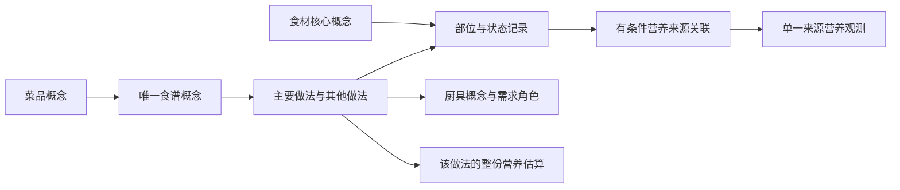

# 概念主干数据契约

## 用户确认的设计

来源不限地区。Wikipedia/Wikidata定义核心概念，缺项允许本地概念；营养数据库只提供样品与观测，不主导目录命名。

## 文件与标识

| 文件 | 主键 | 作用 |
|---|---|---|
| concepts.json | id | 核心和百科参考概念，kind区分用途 |
| ingredient-forms.json | id | 原料概念的状态记录，保留来源旧ID；相似状态不自动合并 |
| recipe-concepts.json | id | 每个菜品唯一容器，无做法时主要做法为空 |
| methods.json | id | 完整保留原有389份做法及出处；原文变体未充分结构化时保留原文 |
| nutrition-links.json | id | 指向一个食材形态与一个营养样品，使用时须确认scope_key |

Wikidata概念沿用WD-Q标识；本地概念按类型及首次名称生成ID。本版本名称与ID冻结，后续改名必须沿用发布ID或提供显式迁移，不得把改名当新概念静默替换。
legacy-map.json记录旧食材和工具ID到新概念的映射。来源表、行号、记录指纹随记录保留。

## 检索

语言与地区属于别名，不属于概念身份。地区仅影响排序；同一个词可以返回多个概念。
未审核的百科别名不直接进入索引。首次确认的地区冲突为土豆（马铃薯/花生）。
源数据中地区信息缺失的别名用空数组表示未知，不能解释为所有地区通用。
搜索仅覆盖已建索引名称和别名，暂未提供模糊检索。简体键由构建时转换冻结；运行搜索函数使用Unicode规范化，无Windows依赖。

## 做法选择

菜品边界由核心原料与主要烹饪方法界定；只有明确的等价标题规则才跨名称合并。
主做法使用确定性排序：是否有步骤、明确数量且已关联原料的比例、份数、厨具证据，最后用稳定ID破同分。
这只评估结构完整度，不代表厨房实测。冻结每次发布中的主要做法，升级通过concept_diff.py明确呈现变动。
只有百科概念没有做法时，食谱容器保持空；不以生成内容补齐。

## 营养计算

输入是具体做法每一行选择的来源关联、scope_key和前处理样品克重。
不得跨原料形态调用关联，不得混拼多个样品，不得把毫升、带壳重量、熟食重量自动变成源样品克重。
输出为整份配方已知原料小计；有任何未选择原料或缺失字段时均标为不完整。
仅完整且有明确份数时输出每份；没有成品重量和烹调依据时不输出每100克成品。
现有38条关联均要求使用条件确认，因此初始做法估算保持不完整，不伪造完整营养值。

## 厨具和来源

厨具需求保留必需、可选、待选替代角色。数量、容量及温度缺失保持未知，替代证据不足时不自动替换。
百科分类与应用分类分别保留来源。只有7条新增核验快照有完整的P31/P279关系，其他关系尚未补齐。
商品信息单列；无法确定具体产品配方的品牌记录维持未绑定状态。

## 发布范围与待办

首版交付数据包、来源关联、构建脚本、检索与关联验证，不含系统导入。
其余同名概念、可能的品牌条目、未拆分部位/加工形式及近义菜名保留待审，不宣称全库身份对齐完成。
原始rc.2压缩包整体保留，避免清洗遗漏导致不可追溯；TFDA观测和百科快照保留各自署名与许可。
